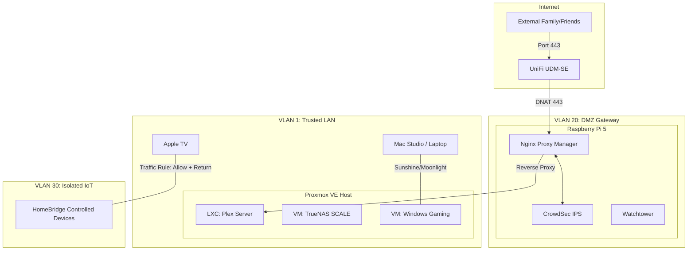
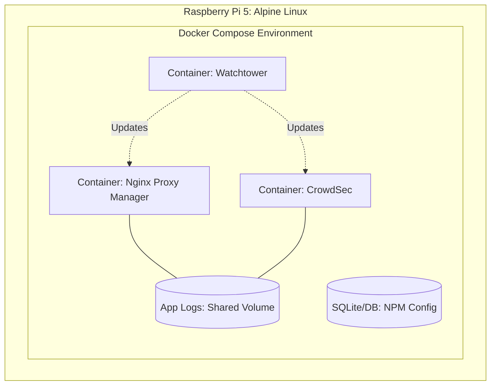
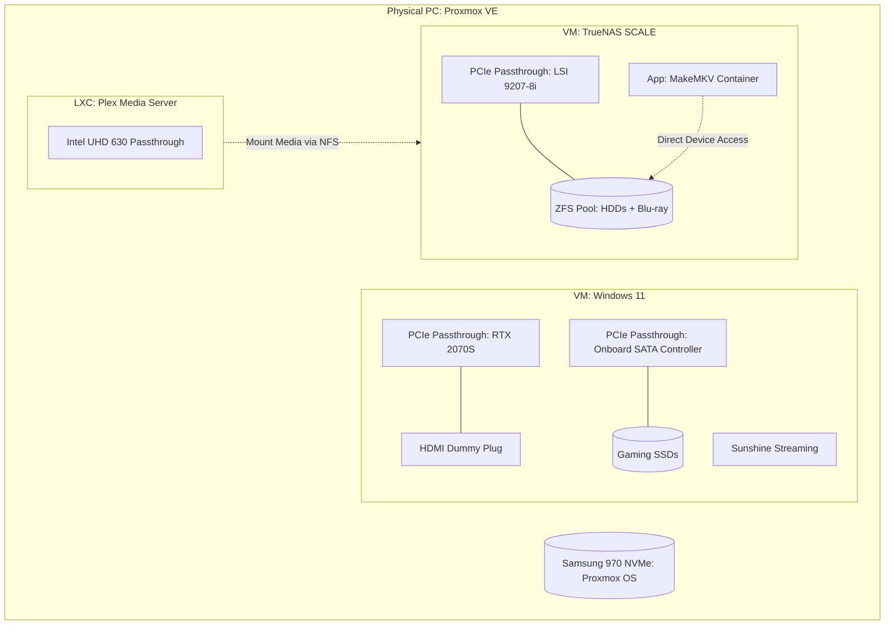

# Design Doc: Hardened Proxmox Infrastructure (Plex-First)

## 1. System Overview & Topology

The goal of this project is to migrate a Windows-based home server to a **Proxmox Virtual Environment**. The final state provides high-bandwidth **Plex media streaming** via a secure DMZ and a **high-performance headless gaming VM** capable of streaming to Mac or Apple TV using Sunshine/Moonlight.

### Network & Security Topology
*High-level view of VLAN isolation and external access.*

## 2. Infrastructure Baseline
These reference facts guide the architectural decisions for this specific build.

### Hardware Baseline
* **CPU:** Intel i7-8700K (6C/12T) — Provides Integrated Graphics (UHD 630) for host console and Plex transcoding.
* **GPU:** EVGA RTX 2070 Super — Dedicated for the Windows Gaming VM via PCIe passthrough.
* **Motherboard:** ASUS PRIME Z370-A — Supports VT-d and clean IOMMU grouping for hardware isolation.
* **Memory:** 32GB DDR4 — Prioritized as 16GB (Gaming), 8GB (TrueNAS), 8GB (Host/LXC).
* **Storage Architecture:**
    * **Boot/VM OS:** Samsung 970 EVO Plus (NVMe) — Proxmox host drive.
    * **HBA Expansion:** LSI 9207-8i (IT Mode) — Dedicated PCIe 3.0 controller passed to TrueNAS for ZFS management of HDDs and Blu-ray drives.
    * **Onboard SATA:** Integrated controller used for motherboard-connected SSDs (allocated to the Windows Gaming VM).

### Software & Security Decisions
* **Hypervisor:** Proxmox VE (Debian-based) for native LXC performance.
* **Storage:** TrueNAS SCALE (VM) with LSI HBA passthrough for data integrity.
* **Gateway:** Raspberry Pi 5 acting as a DMZ gateway hosting a Docker-compose environment (Nginx Proxy Manager, CrowdSec, Watchtower).
* **Networking:** UniFi-backed VLAN isolation (LAN, DMZ, IoT).

### Acknowledged Trade-offs
* **RAM Saturation:** 32GB is the ceiling; additional heavy VMs will require hardware upgrades.
* **I/O Isolation:** By using a dedicated LSI HBA for TrueNAS, the motherboard SATA ports are freed for Proxmox/Gaming VM use, but the HBA occupies a PCIe slot that could otherwise be used for networking or additional GPUs.

## 3. Logical Architecture

### DMZ Gateway Logical Mapping
*Services running within the Docker-compose environment on the Raspberry Pi 5.*

### System Logical Mapping
*Logical architecture of the Proxmox host and hardware passthrough.*

*   **Host (Proxmox):** Manages CPU/RAM allocation; provides the bridge to the UniFi network.
*   **Storage Layer (TrueNAS VM):** Owns the LSI 9207-8i HBA; hosts the **MakeMKV App** for direct Blu-ray ripping to the ZFS pool; shares media datasets to Plex via NFS.
*   **Media Layer (Plex LXC):** Lightweight container; uses iGPU for hardware transcoding; accessible via `plex.bitbarron.duckdns.org`.
*   **Gaming Layer (Windows VM):** Owns the RTX 2070S and the motherboard's integrated SATA controller for bare-metal SSD performance; runs Sunshine for low-latency streaming.
*   **Security Layer (Pi 5 DMZ):** Isolates incoming web traffic. CrowdSec parses application logs to block threats inside the encrypted HTTPS stream.

### Media Ingestion Workflow (MakeMKV)
*The process for adding physical media to the digital library.*

1.  **Interaction:** Access the **MakeMKV Web UI** via the TrueNAS SCALE IP (typically port 8080 or 5800, depending on the App configuration).
2.  **Ripping:** Insert a Blu-ray/DVD into the drive; MakeMKV (with direct device access via the HBA) decrypts and rips the title directly to a "Transcode/Ingest" dataset on the ZFS pool.
3.  **Post-Processing:** (Optional/Manual) Use a tool like Handbrake if compression is needed, or move the raw MKV directly to the `Media/Movies` or `Media/TV` datasets.
4.  **Library Update:** Plex Media Server (mounting the ZFS datasets via NFS) detects the new file and fetches metadata.

## 4. Implementation Roadmap
*A phased, step-by-step rebuild sequence.*

### Phase 1: Smart Home & IoT Hardening
*Goal: Move smart home services and isolate the "chatterbox" devices first.*
- [ ] **VLAN Setup:** Configure VLAN 30 (IoT) in UniFi; create isolated SSID.
- [ ] **LXC - Homebridge:** Deploy a lightweight Debian LXC on the Proxmox host; restore Homebridge backup.
- [ ] **Firewall:**
    - [ ] Block `IoT` -> `LAN/Gateway` (Default Drop).
    - [ ] Allow `Homebridge LXC` -> `IoT` (Established/Related).
- [ ] **Migrate:** Move devices to the new SSID and verify HomeKit functionality.

### Phase 2: Proxmox & TrueNAS Foundation
*Goal: Establish the storage and media layers.*
- [ ] **Hardware:** Install the LSI 9207-8i HBA; connect HDDs and Blu-ray drive.
- [ ] **Infrastructure:** Install Proxmox VE on the primary PC (NVMe drive).
- [ ] **VM - TrueNAS SCALE:** Deploy TrueNAS as a VM.
    - [ ] **HBA Passthrough:** Pass the physical PCIe LSI 9207-8i controller to the TrueNAS VM.
- [ ] **ZFS Setup:** Reformat drives into a ZFS Pool.
- [ ] **Ingestion:** Deploy the **MakeMKV App** within TrueNAS SCALE; verify direct access to the Blu-ray drive for ripping.
- [ ] **Data Migration:** Restore media and personal data from backup into the new ZFS datasets.
- [ ] **Exports:** Configure NFS/SMB shares for internal network use.
- [ ] **LXC - Plex:** Deploy a Linux Container; mount TrueNAS ZFS datasets via NFS; pass through Intel UHD 630 iGPU.

### Phase 3: DMZ & Remote Access
*Goal: Get Plex online and protected by the DMZ.*
- [ ] **Pi 5 - DMZ:** Flash Alpine Linux; deploy NPM, CrowdSec, and Watchtower.
- [ ] **UniFi:** Create VLAN 20 (DMZ); assign Pi 5 port; Forward WAN 443 -> Pi 5.
- [ ] **Plex Config:** Update "Custom server access URL" to `https://plex.bitbarron.duckdns.org:443`.
- [ ] **Validation:** Confirm "Direct Connection" on 5G/Mobile data for family users.

### Phase 4: Headless Gaming VM
*Goal: Restore gaming capability with bare-metal performance.*
- [ ] **IOMMU:** Enable `intel_iommu=on` and isolate the GPU and onboard SATA controller for VFIO.
- [ ] **VM - Gaming:** Create a Windows 11 VM; pass through the RTX 2070S, onboard SATA controller (SSDs), and USB controller.
- [ ] **Streaming:** Install **Sunshine** (Host) + HDMI Dummy Plug; verify low-latency stream to Mac/ATV.

## 5. Operations & Maintenance
*A strategy focused on data integrity and security posture through automated updates.*

### Update & Security Strategy
- **Containerized Apps:** **Watchtower** on the Raspberry Pi 5 handles automatic updates for NPM and CrowdSec.
- **LXC Containers:** `unattended-upgrades` configured for the Homebridge and Plex LXC OS (Debian/Ubuntu).
- **Proxmox Host:** Periodic manual updates (`apt update && apt dist-upgrade`) after verifying VM/LXC snapshots.
- **TrueNAS SCALE:** Manual updates via the web UI to ensure ZFS pool compatibility.

### Backup & Snapshot Policy
- **Data (ZFS):** TrueNAS ZFS Snapshots (Daily/Weekly) for the media and personal datasets.
- **VMs/LXCs:** Proxmox scheduled backups to a dedicated Proxmox Backup Server or a remote NFS share (TrueNAS).
- **Configuration:** Off-site backups of the UniFi UDM-SE, NPM database, and Homebridge configuration.

### System Health & Integrity
- **ZFS Scrubbing:** Scheduled bi-weekly pool scrubs to detect and repair bit rot.
- **SMART Tests:** Scheduled short/long SMART tests for all physical drives (HDDs/SSDs) to monitor for early signs of failure.
- **IPS/IDS:** CrowdSec logs monitored for persistent threats; UniFi IDP active on the WAN interface.
