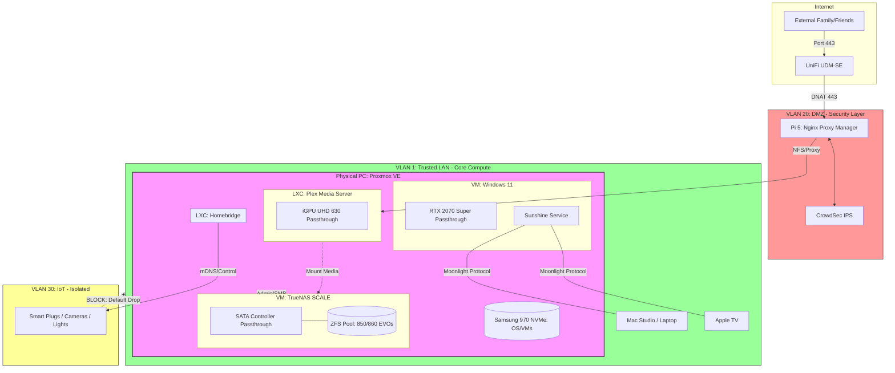

# Project: Hardened Proxmox Infrastructure (Plex-First)

## Project Summary

The goal of this project is to migrate a Windows-based home server to a hardened **Proxmox Virtual Environment**. The final state will provide high-availability **Plex media streaming** for friends and family via a secure DMZ, and a **high-performance headless gaming VM** capable of streaming AAA titles to a Mac or Apple TV over the local network using Sunshine/Moonlight.

## 1. Project Context & Design Constraints
These reference facts guide the architectural decisions for this specific build.

### Hardware Baseline
* **CPU:** Intel i7-8700K (6C/12T) — Provides Integrated Graphics (UHD 630) for host console and Plex transcoding.
* **GPU:** EVGA RTX 2070 Super — Dedicated for the Windows Gaming VM via PCIe passthrough.
* **Motherboard:** ASUS PRIME Z370-A — Supports VT-d and clean IOMMU grouping for hardware isolation.
* **Memory:** 32GB DDR4 — Approaching capacity; prioritized as 16GB (Gaming), 8GB (TrueNAS), 8GB (Host/LXC).
* **Storage Architecture:**
    * **Boot/VM OS:** Samsung 970 EVO Plus (NVMe) — Must house Proxmox to free up the SATA controller.
    * **Data Pool:** Samsung 850/860 EVO (SATA) — Passed directly to TrueNAS for ZFS management.

### Software & Security Decisions
* **Hypervisor:** Proxmox VE (Debian-based) for native LXC performance.
* **Storage:** TrueNAS SCALE (VM) with HBA passthrough for data integrity.
* **Gateway:** Raspberry Pi 5 acting as a DMZ gateway (Nginx Proxy Manager + CrowdSec).
* **Networking:** UniFi-backed VLAN isolation (LAN, DMZ, IoT).

### Acknowledged Trade-offs
* **RAM Saturation:** With 32GB, running additional heavy VMs beyond the Gaming/TrueNAS core will require a hardware upgrade.
* **SATA Controller Lock:** By passing the onboard SATA controller to TrueNAS, Proxmox cannot use any SATA ports for local storage; all VM disks must reside on NVMe or be served via NFS.

## Implementation Design

### System Logical Mapping
* **Host (Proxmox):** Manages CPU/RAM allocation; provides the bridge to the UniFi network.
* **Storage Layer (TrueNAS VM):** Owns the physical SATA bus; shares media datasets to Plex via NFS and personal backups via SMB.
* **Media Layer (Plex LXC):** Lightweight container; uses iGPU for hardware transcoding; accessible via `plex.bitbarron.duckdns.org`.
* **Gaming Layer (Windows VM):** Owns the RTX 2070S; runs Sunshine for low-latency streaming to Mac/Apple TV clients.
* **Security Layer (Pi 5 DMZ):** Isolates all incoming web traffic (Port 443) before it hits the internal network.

### Target Network Topology
| Segment | CIDR/VLAN | Purpose |
| :--- | :--- | :--- |
| **LAN** | 10.67.1.0/24 (VLAN 1) | Proxmox Host, Trusted Compute, Gaming Stream |
| **DMZ** | 10.67.20.0/24 (VLAN 20) | Pi 5 (Nginx Proxy Manager + CrowdSec) |
| **IoT** | 10.67.30.0/24 (VLAN 30) | Smart Home (Isolated via Homebridge) |

---

## Phase-by-Phase Execution

### Phase 1: Proxmox & TrueNAS Foundation
*Goal: Establish the storage layer.*
- [ ] **Infrastructure:** Install Proxmox VE on the primary PC.
- [ ] **VM - TrueNAS SCALE:** Deploy TrueNAS as a VM.
    - [ ] **HBA Passthrough:** Pass the physical PCIe SATA/SAS controller to the TrueNAS VM.
- [ ] **ZFS Setup:** Reformat drives into a ZFS Pool.
- [ ] **Data Migration:** Restore media and personal data from backup into the new ZFS datasets.
- [ ] **Exports:** Configure NFS/SMB shares for internal network use.
- [ ] **LXC - Plex:** Deploy a Linux Container; mount TrueNAS ZFS datasets via NFS.

### Phase 2: DMZ for Remote Plex Streaming
*Goal: Get Plex online and protected by the DMZ.*
- [ ] **Pi 5 - DMZ:** Flash Alpine Linux; deploy NPM, CrowdSec, and Watchtower. 
- [ ] **UniFi:** Create VLAN 20 (DMZ); assign Pi 5 port; Forward WAN 443 -> Pi 5.
- [ ] **Plex Config:** Update "Custom server access URL" to `https://plex.bitbarron.duckdns.org:443`.
- [ ] **Validation:** Confirm "Direct Connection" on 5G/Mobile data for family users.

### Phase 3: Homebridge & IoT Hardening
*Goal: Move smart home services and isolate the "chatterbox" devices.*
- [ ] **LXC - Homebridge:** Deploy a lightweight Debian LXC; restore Homebridge backup.
- [ ] **VLAN Setup:** Configure VLAN 30 in UniFi; create isolated SSID.
- [ ] **Firewall:**
    - [ ] Block `IoT` -> `LAN/Gateway` (Default Drop).
    - [ ] Allow `Homebridge LXC` -> `IoT` (Established/Related).
- [ ] **Migrate:** Move devices to the new SSID and verify HomeKit functionality.

### Phase 4: Headless Gaming VM
*Goal: Restore gaming capability with bare-metal performance.*
- [ ] **IOMMU:** Enable `intel_iommu=on` (or `amd`) and isolate the GPU for VFIO.
- [ ] **VM - Gaming:** Create a Windows 11 VM; pass through the GPU and USB controller.
- [ ] **Streaming:** Install **Sunshine** (Host) + HDMI Dummy Plug.

---

## Maintenance & Automation Strategy
* **Snapshots:** Use TrueNAS ZFS Snapshots for data; Proxmox backups for VMs.
* **Updates:** Watchtower for containerized apps; `unattended-upgrades` for LXC OS.
* **Scrubbing:** Scheduled ZFS pool scrubs (Bi-weekly) and SMART tests.